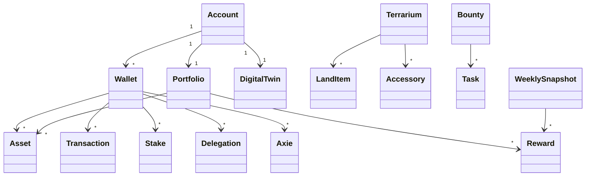

# AxieOS Domain Model

Version: 2.0 (Draft)

---

# Purpose

The Domain Model defines the core business concepts of AxieOS and the relationships between them.

AxieOS models a user's GameFi operation as a **Digital Twin**. The domain model is intentionally independent of spreadsheets, databases, APIs, or programming languages.

It represents **what exists**, not **how it is implemented**.

---

# This Document Answers

- What entities exist in AxieOS?
- How are those entities related?
- What responsibilities does each entity have?
- Which concepts are considered part of the core domain?

---

# Domain Philosophy

AxieOS models a GameFi operation rather than a single blockchain or game.

The objective is to build a reusable Digital Twin capable of representing assets, gameplay, investments, and strategies across the Axie Infinity ecosystem.

As the ecosystem evolves, implementation details may change, but the business concepts should remain stable.

---

# Core Domain

The following entities form the foundation of AxieOS.

## Core

- Account
- Digital Twin
- Wallet
- Portfolio
- Asset
- Transaction
- Reward

## Gameplay

- Axie
- Terrarium
- Land Item
- Accessory
- Stake
- Delegation

## Bounty Board

- Bounty
- Task
- Weekly Snapshot

---

# Core Entity Definitions

---

## Account

Represents the owner of one or more wallets.

An Account may represent:

- Individual player
- Business
- Guild
- Organization
- Future AI-controlled account

### Responsibilities

- Own wallets
- Own portfolios
- Receive analytics
- Configure strategies

---

## Digital Twin

Represents the virtual model of an Account.

The Digital Twin combines blockchain data, gameplay history, portfolio information, and analytics into a single decision-support model.

The Digital Twin is the primary object analyzed by AxieOS.

### Responsibilities

- Synchronize wallet data
- Maintain portfolio state
- Generate analytics
- Support simulations
- Provide AI recommendations

---

## Wallet

Represents a blockchain wallet.

A Wallet stores assets and records transactions.

Multiple wallets may belong to the same Account.

Examples include:

- Gameplay wallet
- Treasury wallet
- Trading wallet
- Cold storage wallet

### Responsibilities

- Hold assets
- Record blockchain activity
- Participate in staking
- Delegate NFTs

---

## Portfolio

Represents the collection of assets owned by an Account.

A Portfolio contains current balances and asset allocation.

Portfolio values are calculated from Transactions.

### Responsibilities

- Track asset balances
- Measure allocation
- Support ROI analysis
- Support performance analysis

---

## Asset

Represents any asset recognized by AxieOS.

Examples include:

### Tokens

- AXS
- bAXS
- RON
- SLP
- USDC
- WETH

### NFTs

- Axies
- Land Plots
- Land Items
- Accessories

### Responsibilities

- Represent ownership
- Store metadata
- Support valuation

---

## Transaction

Represents any event that changes the state of a Portfolio.

Examples include:

- Marketplace purchase
- Marketplace sale
- Reward claim
- Stake deposit
- Stake withdrawal
- Token swap
- NFT purchase
- NFT sale
- Breeding
- Evolution
- Ascension

Transactions form the historical record of the Digital Twin.

---

## Reward

Represents assets earned through gameplay or participation.

Examples include:

- bAXS
- AXS
- Event rewards

Rewards contribute to Portfolio growth.

---

## Stake

Represents assets deposited into staking.

Current supported assets include:

- AXS
- bAXS

Future staking products may be added without changing the core model.

---

## Delegation

Represents the temporary assignment of NFTs to another wallet.

Delegation includes:

- Delegated assets
- Permissions
- Expiration date
- Slip sharing
- Gameplay permissions

Delegation does not transfer ownership.

---

## Axie

Represents an Axie NFT.

An Axie may participate in multiple games and activities across the ecosystem.

Examples include:

- Origins
- Homeland
- Atia's Legacy (future)

Axie attributes may evolve over time.

---

## Terrarium

Represents a Homeland land plot producing Atia Flame and rewards.

Terrariums may contain:

- Land Items
- Accessories

Terrariums contribute to weekly production.

---

## Land Item

Represents equipment placed inside a Terrarium.

Land Items improve Terrarium performance.

---

## Accessory

Represents decorative or functional equipment used within a Terrarium.

Accessories may influence Atia Flame generation or future mechanics.

---

## Bounty

Represents one daily Bounty Board.

A Bounty contains multiple Tasks.

---

## Task

Represents a single objective on the Bounty Board.

Examples include:

- Breed an Axie
- Feed Cocochoco
- Reach Floor 3
- Buy an Axie
- Release an Axie

Tasks award points toward weekly rankings.

---

## Weekly Snapshot

Represents one completed bounty week.

A Weekly Snapshot stores historical performance.

Examples include:

- Week number
- Total points
- Final rank
- bAXS rewards
- Efficiency metrics

Weekly Snapshots support long-term analysis.

---

# Entity Relationships

The following diagram illustrates the high-level relationships between the core entities.

---

# Design Principles

The Domain Model follows these principles:

- Model real-world GameFi concepts.
- Separate business concepts from implementation details.
- Support multiple wallets per account.
- Preserve historical records.
- Design for future expansion across the Axie ecosystem.
- Remain blockchain-agnostic whenever practical.

---

# Future Expansion

The following entities are expected to be introduced in future releases:

- Marketplace
- Strategy
- Prediction
- Recommendation
- Simulation
- AI Agent
- Guild
- Scholarship
- Treasury
- Governance

---

# Revision History

| Version | Date | Notes |
|----------|------------|------------------------------------------|
| 2.0 | 2026-07-19 | Complete refactor of the Domain Model adopting the Digital Twin architecture. |
